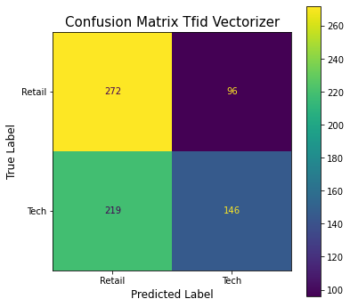

# Project: Reddit Subreddit Title/Selftext Classification

# Problem Statement:

For this project, I am exploring the Title/Selftext of posts in two semi-related subreddits, and whether several different classifiers can correctly group posts into their respective buckets. I will be looking at posts from TalesFromRetail & TalesFromTechSupport. I chose these two subreddits because I wanted something relatively similar (both deal with talking about their jobs) but different enough that there will be some signal to the noise for classification purposes. If we can find a classification model that is statistically significant, we can then take the model into other areas of interest and explore further. Big Picture, text classifiers are used to help standardize the web, so the better our classifier, the better we could theoretically create a sentiment analysis, spam/document detector or other word classification system. 

# Data Collection/Cleaning:

Since we need the data straight from Reddit itself, I web scraped ~1500 title/selftext posts from each respective subreddit using Pushshift API. Overall, the data was generally good, in the roughly 3000 posts I had collected, roughly 2% produced null values, so those rows were deleted. This left a distribution by subreddit in our data frame of 50.18% - TalesFromTechSupport and 49.81% - TalesFromRetail. The higher of the two will be our Baseline Accuracy for all future comparisons.

# Exploratory Data Analysis:

After the data was cleaned and prepared for further analysis, I wanted to get a good sense of what words appeared and their frequencies. To achieve this, I tokenized all words in both title and selftext columns and then applied a porter stemmer to bring everything down to the root word to see cumulative counts of similar words. After this was completed, I used a count vectorizer with English stop words to produce a data frame with the result we need.

Let’s start with title posts first, I creadted two charts detailing title words and their frequencies and have each sorted by respective subreddits:

As you can see above, there are several words in both charts that are seen several times (work, thi, job, call, whi). These words don’t give us much info except that they are heavy into both subreddits and therefore do not provide much signal. As we look at the differences between both, we can start to see what sets them apart.

The largest difference in Tech Support is the following: support, tech, user, 2021, comput, help, recruit

The largest difference in Retail is the following: custom, want, store, retail, lady, karen

For the title posts, these words listed above are going to be our greatest signal with determining where these posts came from.

Now, let’s move onto the selftext posts which will normally have more text on them than titles. I produced the same charts as above but used selftext data as my input instead:

The selftext posts produced less signal than the respective title posts, but there are still small things to catch when we look at the top 15 words in each respective subreddit selftext. The largest difference in frequency for retail was the word store/custom, while interestingly every other top word in retail was dwarfed by the number of words in tech support. This is due to word count in tech support selftext being on average much higher than retail.

As we look at tech support posts, the largest difference in word we find is user. This makes sense from a technical perspective since that word is prevalent in the IT field. Everything else had a relative gap as noticed above, but the word counts are also much higher as stated above so that must be considered.

# Model Evaluation:

For the purpose of this classification evaluation, we are going to be using 3 different types of machine learning models on the data we have created above:

- **Logistic Regression**
- **K Nearest Neighbors**
- **Random Forests**

For each respective classifier, we will produce two models using different vectorizers (**CountVectorizer** & **TfidfVectorizer**). We are employing the use of a pipe and grid search to find the optimal parameters for each respective model. We will have 6 models after our analysis is finished, all with varying statistical scores we can analyze. Let’s start with Logistic Regression:

### Logistic Regression:

 

Our tuned Log Reg models produced high scores for a first go through. With Accuracy scores in both Count and Tfidf of 82.26%/82.54%. Both models produced lower sensitivity scores (Type I errors) than comparitive classification metrics (Detailed statistical list below).

Next, we tried our two vectorizers on K Nearest Neighbors:

### K Nearest Neighbors:

 

This model was considerably worse than our Log Reg model above, but was still better than our Baseline Accuracy (50.18%). Accuracy scores for CountVec of 68.49% and TfidfVec of 57.03% were not great, but still greater than Baseline. Our most alarming metric for KNN is Sensitivity which produced ~40% score for both vectorizers. Our only bright spot with KNN, was that the CountVectorizer produced the highest Specificity score of any of our models (95.38%).

Our final model that we are analyzing our vectorizers on is Random Forests:

### Random Forests:

 

Our random forests produced more balanced scores compared to our logistic regression. Similar to Logistic, the forests also struggled with Sensitivity, but produced the highest precision score in all our models (91.19%). Accuracy scores for both vectorizers are relatively close being 83.77% (Count) and 83.36% (Tfidf). Scores for Sensitivity (Type I) also struggled along with the other models but was in line with our Logistic Regression Scores.

Now that we have 6 models, we are going to create a **stack** of our 6 models & their respective optimal hyperparameters and then perform a second level on the model with a Logistic Regression since that produced generally the highest score.

Our stack model did not increase our overall Accuracy or Cross Val compared to our best Log Reg model, but it did produce the highest sensitivity score (80.55%) which reduced our Type I Errors. The stack model was also the only model that produced all metrics above 80%.

If we look at some Summary Statistics, we can see some interesting trends:

All models produce something different that it excels at. Our model with multiple highest metrics it is the Logistic Regression model (Cross-Val-Score & Accuracy). If we look at the average distribution of metrics, our stack model produced the lowest metric Standard Deviation, which resulted in the amount of Type I/II Errors being reduced. Our TfidfVec Logistic Regression model produced on average the highest mean statistical metrics.

# Conclusion

Through the analysis of our 6 models and stack, we have found two viable models that are relatively close and provide a good model distribution. The **TfidVectorizer in our Logistic Regression** model and our **Stack** model both produce good results in terms of all metrics mentioned above in our Statistics Summary. While the Log Reg model produces higher overall scores, our stack produces **less deviation** in metric scores. Either model is relatively similar at predicting our classification while our stack is slightly better at producing a more balanced approach to reduced Type I/II errors. Due to time constraints, full analysis into why models produced higher Type I errors is one of the first things that will be evaluated as further analysis is created.

